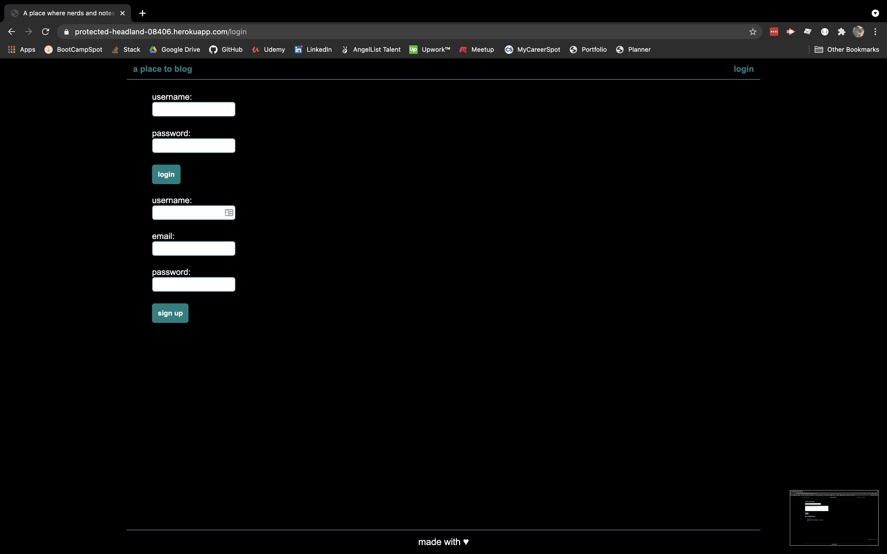
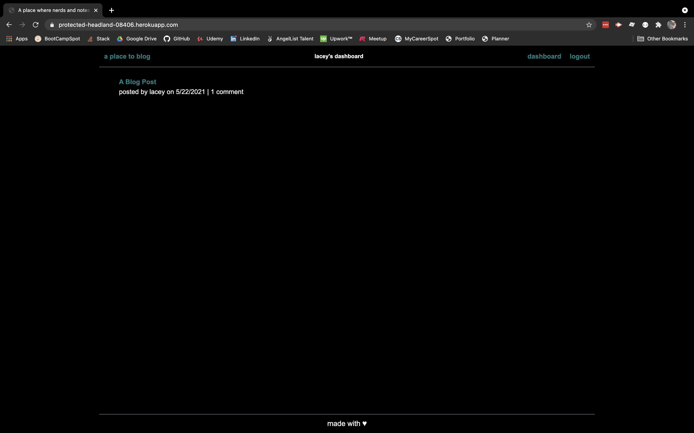
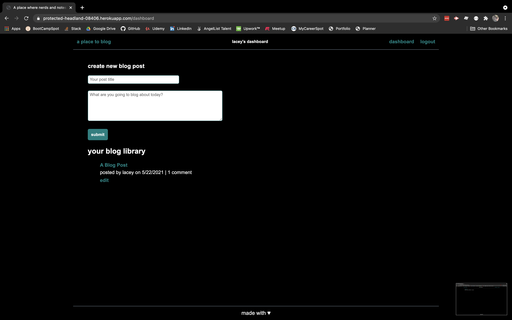

# Tech Blog

## Description
A deployed application for bloggers to post about tech related information and share comments on blog posts.

## Table Of Contents
* [Installation](#installation)
* [Usage](#usage)
* [License](#license)
* [Contributions](#contributions)
* [Questions](#questions)

## Installation
No install needed, click [here](https://protected-headland-08406.herokuapp.com/) to visit the application.

## Usage
To use this application simply visit the deployed site and sign up to begin sharing blog posts and commenting on other users' posts.

## Licensing
This project is covered under the following licenses:
MIT

## Contributing
This project was created by lacey-griffith.

## Questions
If you have any questions please contact me at lacey.griffith04@gmail.com.
You can also visit my GitHub profile by clicking [here](https://github.com/lacey-griffith) and the repository for this project can be found [here](https://github.com/lacey-griffith/tech-blog).

## Site Images
Example of the login and sign-up screen.

Example of the homepage screen.

Example of the screen when a logged in user is creating a new post.
